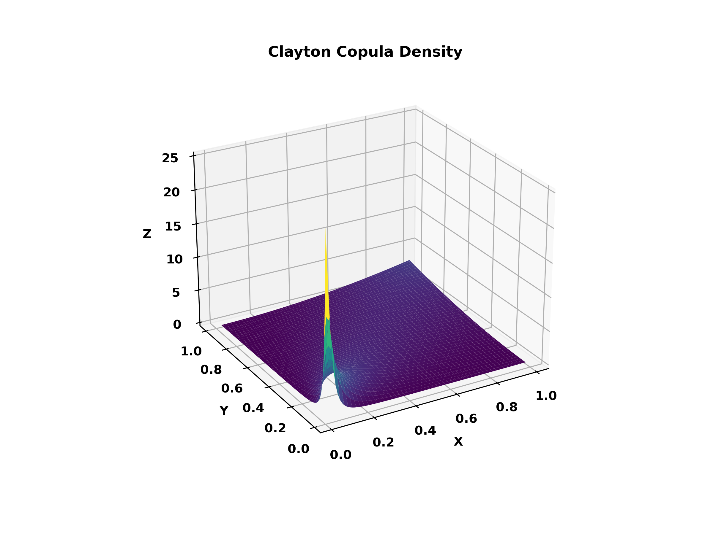

# MSRpdf_cop_Clayton
Produces simple plot of the Clayton copula density with parameter theta = 2.

```python
#works on numpy 1.25.2, statsmodels 0.14 and matplotlib 3.8.0
import numpy as np
import matplotlib.pyplot as plt
from mpl_toolkits.mplot3d import Axes3D
from statsmodels.distributions.copula.api import ClaytonCopula

u = np.linspace(0.02, 0.99, 100)
v = np.linspace(0.02, 0.99, 100)
U, V = np.meshgrid(u, v)

copula = ClaytonCopula(theta = 2, k_dim=2)
uv_grid = np.column_stack((U.reshape(-1), V.reshape(-1)))
copula_density = copula.pdf(uv_grid)
copula_density = copula_density.reshape(U.shape)

fig = plt.figure(figsize=(8, 6))
ax = fig.add_subplot(111, projection='3d')
ax.plot_surface(U, V, copula_density, cmap='viridis')
ax.set_xlabel('X')
ax.set_ylabel('Y')
ax.set_zlabel('Z')
ax.set_zlim(0,25)
ax.set_title('Clayton Copula Density')
ax.view_init(elev=25, azim=240)

plt.show()
```
