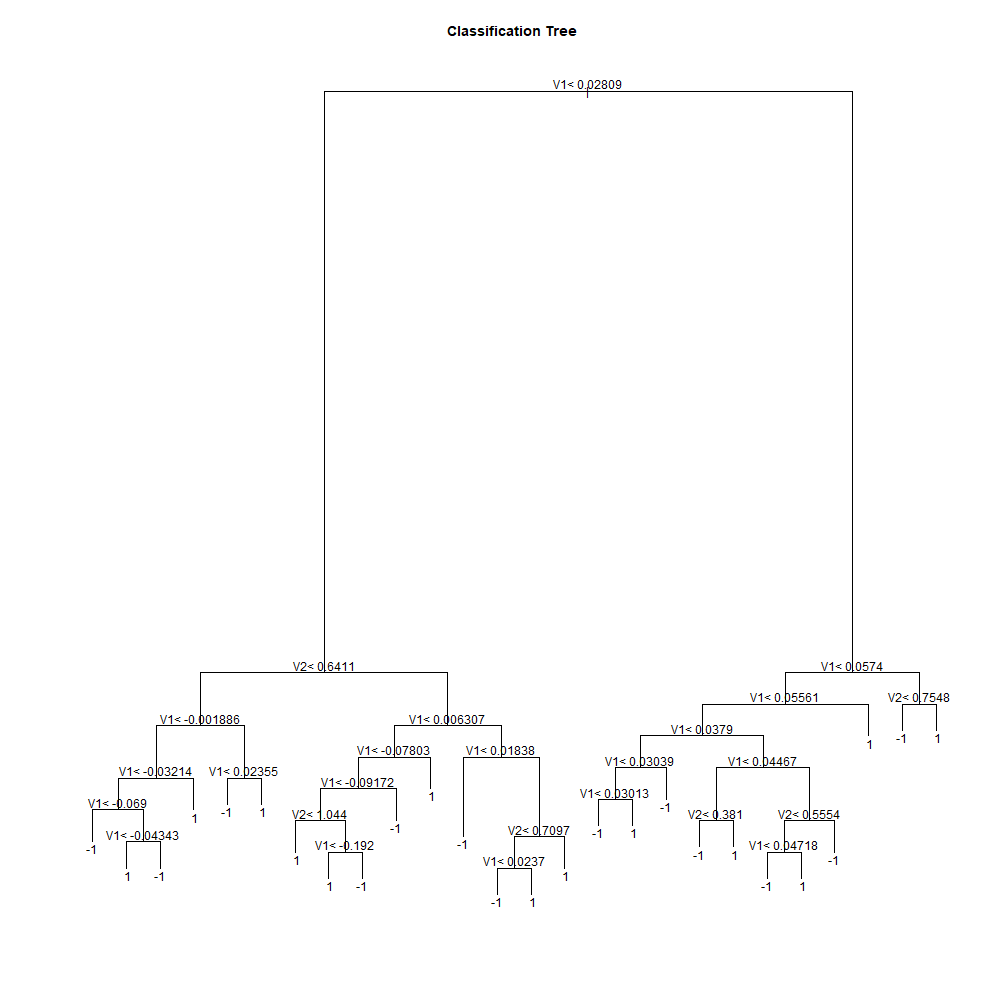

# MVACARTTwoingTree1
Performs classification analysis and plots the classification tree for the US bankruptcy data with 84 companies employing the twoing rule.

```python
# tested with pandas 2.2.1, numpy 1.26.4, matplotlib 3.8.4, rpy2 3.5.16

# import libraries
import pandas as pd
import numpy as np
import matplotlib.pyplot as plt

# since Twoing criteria for decision tree classification is currently not 
# implemented in Python, R packages are imported and used
import rpy2
import rpy2.robjects as robjects
from rpy2.robjects.packages import importr, data

# import R libraries
rpart = importr("rpart")
rpartScore = importr("rpartScore")
r_base = importr('base')
utils = importr("utils")
graphics = importr("graphics")
grdevices = importr('grDevices')

# read data
x = utils.read_table("bankruptcy.dat")
xx = r_base.data_frame(x)

# set the controls
my_control = rpart.rpart_control(minsplit = 1, usesurrogate = 2, minbucket = 1, 
                                 maxdepth = 30, surrogatestyle = 1, cp = 0)

# create classification tree with twoing rule
t2 = rpartScore.rpartScore("V3 ~ V1 + V2", xx, split = "abs", prune = "mr", 
                           control = my_control)

# plot classification tree and save the plot
grdevices.png(file = "MVACARTTwoingTree1_python.png", width=1000, height=1000)
r_base.plot(t2)
graphics.text(t2, cex = 1) 
graphics.title(r_base.paste("Classification Tree "))
grdevices.dev_off()
```
