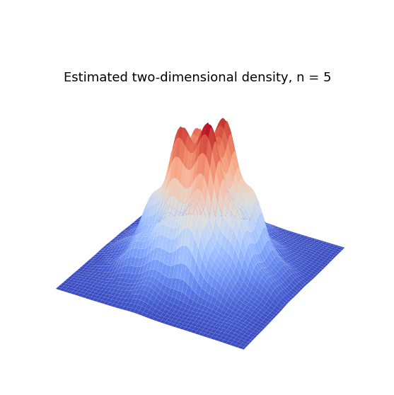

# MVAcltbern2
Illustrates the 2D Central Limit Theorem (CLT). n*2000 sets of n-dimensional
Bernoulli samples are generated and used to approximate the distribution of t =
sqrt(n)*(mean(x)-mu)/sigma -> N(0,1). The estimated joint density is shown.

```python
# works on numpy 1.23.5, scipy 1.10.0 and matplotlib 3.6.2
import numpy as np
from scipy.stats import binom
from scipy.stats import gaussian_kde
import matplotlib.pyplot as plt
from matplotlib import cm

p = 0.5
n = [5,85]

for n in n:
    
    fig, axs = plt.subplots(1,1, figsize=(10,10), subplot_kw={'projection': '3d'})
    bsample = binom.rvs(1, p, size=n*2000)
    bsamplem = bsample.reshape((n, 2000))
    bsamplemstd = (np.mean(bsamplem, axis=0) - p) / np.sqrt(p * (1 - p) / n)
    bsamplemstd = bsamplemstd.reshape((1000,2))

    dj = gaussian_kde(bsamplemstd.T, bw_method=1.06 * np.std(bsamplemstd) * 200**(-1/5))

    X, Y = np.mgrid[-3:3:100j, -3:3:100j]
    Z = dj(np.vstack([X.ravel(), Y.ravel()])).reshape(X.shape)

    axs.plot_surface(X, Y, Z, cmap=cm.coolwarm)
    axs.set_title(f"Estimated two-dimensional density, n = {n}", fontsize = 18, y = 0.86)
    axs.axis('off')

    plt.show()
```


