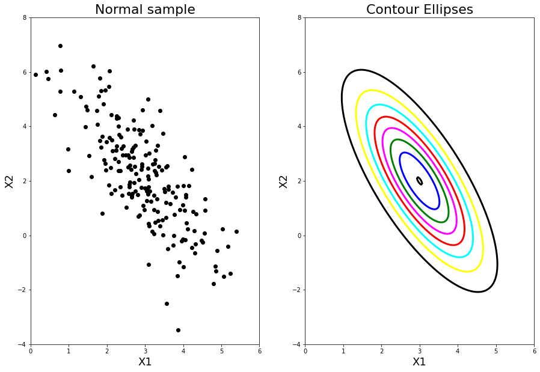

# MVAcontnorm
Produces a scatterplot of a normal sample and the contour ellipses for mu = (3,2) and
sigma = (1,-1.5)~(-1.5,4).

```python
# works on numpy 1.23.5, scipy 1.10.0 and matplotlib 3.6.2
import matplotlib.pyplot as plt
import numpy as np
from scipy.stats import multivariate_normal

np.random.seed(1)
n = 200  # number of draws
mu = np.array([3, 2])  # mean vector
sig = np.array([[1, -1.5], [-1.5, 4]])  # covariance matrix

y = np.random.multivariate_normal(mu, sig, n)

xgrid = np.linspace(mu[0] - 3 * np.sqrt(sig[0, 0]), mu[0] + 3 * np.sqrt(sig[0, 0]), 200)
ygrid = np.linspace(mu[1] - 3 * np.sqrt(sig[1, 1]), mu[1] + 3 * np.sqrt(sig[1, 1]), 200)
X, Y = np.meshgrid(xgrid, ygrid)
pos = np.dstack((X, Y))
rv = multivariate_normal(mu, sig)
z = rv.pdf(pos)

fig, axs = plt.subplots(ncols=2, figsize= (15,10))
axs[0].scatter(y[:, 0], y[:, 1], c='black')
axs[0].set_xlabel('X1', fontsize = 18)
axs[0].set_ylabel('X2', fontsize = 18)
axs[0].set_xlim([np.min(xgrid), np.max(xgrid)])
axs[0].set_ylim([np.min(ygrid), np.max(ygrid)])
axs[0].set_title('Normal sample', fontsize = 22)

axs[1].contour(xgrid, ygrid, z, levels=10, colors=('blue', 'black', 'yellow', 'cyan', 'red', 'magenta', 'green', 'blue', 'black'), linewidths=3)
axs[1].set_xlabel('X1', fontsize = 18)
axs[1].set_ylabel('X2', fontsize = 18)
axs[1].set_xlim([np.min(xgrid), np.max(xgrid)])
axs[1].set_ylim([np.min(ygrid), np.max(ygrid)])
axs[1].set_title('Contour Ellipses', fontsize = 22)

plt.show()
```

