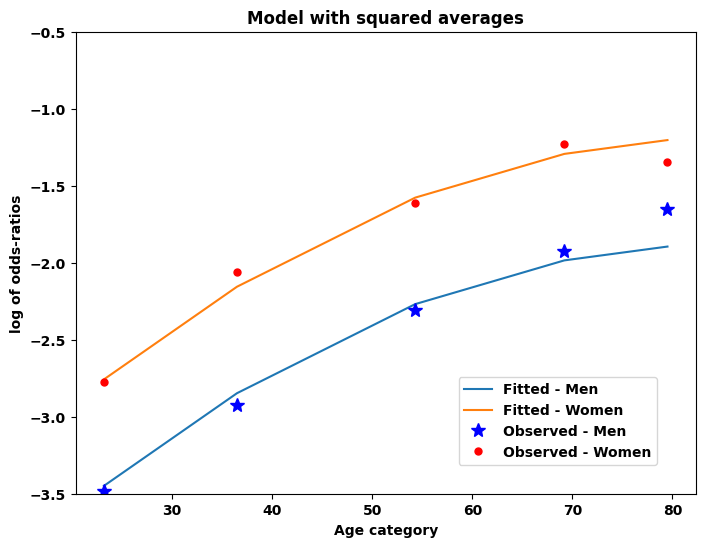

# MVAdruglogistic
Calculates and plots the odds-ratios of the probability of taking drugs in a logit
model for a gender-age group combination and tests two models (one without a curvature and more
general model with a curvature term).

```python
#works on numpy 1.25.2, scipy 1.11.2 and matplotlib 3.8.0
import numpy as np
import scipy.optimize as opt
import matplotlib.pyplot as plt
from scipy import stats

# Drug data
zi = np.array([
    [1, 0, 1, 0, 1, 0, 0, 0, 0, 21],
    [1, 0, 1, 0, 0, 1, 0, 0, 0, 32],
    [1, 0, 1, 0, 0, 0, 1, 0, 0, 70],
    [1, 0, 1, 0, 0, 0, 0, 1, 0, 43],
    [1, 0, 1, 0, 0, 0, 0, 0, 1, 19],
    [1, 0, 0, 1, 1, 0, 0, 0, 0, 683],
    [1, 0, 0, 1, 0, 1, 0, 0, 0, 596],
    [1, 0, 0, 1, 0, 0, 1, 0, 0, 705],
    [1, 0, 0, 1, 0, 0, 0, 1, 0, 295],
    [1, 0, 0, 1, 0, 0, 0, 0, 1, 99],
    [0, 1, 1, 0, 1, 0, 0, 0, 0, 46],
    [0, 1, 1, 0, 0, 1, 0, 0, 0, 89],
    [0, 1, 1, 0, 0, 0, 1, 0, 0, 169],
    [0, 1, 1, 0, 0, 0, 0, 1, 0, 98],
    [0, 1, 1, 0, 0, 0, 0, 0, 1, 51],
    [0, 1, 0, 1, 1, 0, 0, 0, 0, 738],
    [0, 1, 0, 1, 0, 1, 0, 0, 0, 700],
    [0, 1, 0, 1, 0, 0, 1, 0, 0, 847],
    [0, 1, 0, 1, 0, 0, 0, 1, 0, 336],
    [0, 1, 0, 1, 0, 0, 0, 0, 1, 196]
])

y = zi[:, 9]

I, J, K = 2, 2, 5
average = np.array([[23.2], [36.5], [54.3], [69.2], [79.5], [23.2], [36.5], [54.3], [69.2], [79.5]])
X = np.array([
    [1, 1],
    [1, 1],
    [1, 1],
    [1, 1],
    [1, 1],
    [1, -1],
    [1, -1],
    [1, -1],
    [1, -1],
    [1, -1]
])

X1 = np.hstack((X, average))

n1jk = y[zi[:, 2] == 1]
n2jk = y[zi[:, 2] == 0]

b0 = np.zeros(X1.shape[1])

def ff(b0):
    p1 = np.exp(X1 @ b0) / (1 + np.exp(X1 @ b0))
    p2 = 1 - p1
    return -np.sum(n1jk * np.log(p1) + n2jk * np.log(p2))

b = opt.minimize(ff, b0).x

p1 = np.exp(X1 @ b) / (1 + np.exp(X1 @ b))
p2 = 1 - p1
nfit = np.hstack(((n1jk + n2jk) * p1, (n1jk + n2jk) * p2))
nobs = np.concatenate((n1jk, n2jk))

e = np.log(nobs) - np.log(nfit)

df = X1.shape[0] - X1.shape[1]
G2 = 2 * np.sum(nobs * e)
pvalG2 = 1 - stats.chi2.cdf(G2, df)
chi2 = np.sum(((nobs - nfit) ** 2) / nfit)

print("Degrees of freedom:", df)
print("G2:", round(G2,4))
print("p-value G2:", round(pvalG2,4))
print("Chi-squared:", round(chi2,4))

oddratfit = np.log(p1 / p2)
oddrat = np.log(n1jk / n2jk)

fig, ax = plt.subplots(1,1, figsize=(8,6))

ax.plot(X1[:K, -1], oddratfit[:K], label="Fitted - Men")
ax.plot(X1[K:2 * K, -1], oddratfit[K:2 * K], label="Fitted - Women")
ax.plot(X1[:K, -1], oddrat[:K], 'b*', markersize=10, label="Observed - Men")
ax.plot(X1[K:2 * K, -1], oddrat[K:2 * K], 'r.', markersize=10, label="Observed - Women")
ax.set_xlabel("Age category")
ax.set_ylabel("Log of odds-ratios")
ax.set_ylim(-3.5, -0.5)
ax.set_title("Model without squared averages")
fig.legend(loc=(0.65,0.15))
plt.show()

#model with squared averages
X2 = np.hstack((X1,average**2))
n, n2 = X2.shape
df2 = n - n2

n1jk = y[zi[:, 2] == 1]
n2jk = y[zi[:, 2] == 0]

b0 = np.zeros(X2.shape[1])

def f2(b0):
    p1 = np.exp(X2 @ b0) / (1 + np.exp(X2 @ b0))
    p2 = 1 - p1
    return -np.sum(n1jk * np.log(p1) + n2jk * np.log(p2))

b = opt.minimize(f2, b0).x

p1 = np.exp(X2 @ b) / (1 + np.exp(X2 @ b))
p2 = 1 - p1
nfit = np.hstack(((n1jk + n2jk) * p1, (n1jk + n2jk) * p2))
nobs = np.concatenate((n1jk, n2jk))
e = np.log(nobs) - np.log(nfit)

GG2 = 2 * np.sum(nobs * e)
pvalGG2 = 1 - stats.chi2.cdf(GG2, df2)
chi2 = np.sum(((nobs - nfit) ** 2) / nfit)

print("Degrees of freedom:", df2)
print("G2:", round(GG2,4))
print("p-value G2:", round(pvalGG2,4))
print("Chi-squared:", round(chi2,4))

oddratfit = np.log(p1 / p2)
oddrat = np.log(n1jk / n2jk)

fig, ax = plt.subplots(1,1, figsize=(8,6))
ax.plot(X2[:K, -2], oddratfit[:K], label="Fitted - Men")
ax.plot(X2[K:2 * K, -2], oddratfit[K:2 * K], label="Fitted - Women")
ax.plot(X2[:K, -2], oddrat[:K], 'b*', markersize=10, label="Observed - Men")
ax.plot(X2[K:2 * K, -2], oddrat[K:2 * K], 'r.', markersize=10, label="Observed - Women")
ax.set_ylim(-3.5, -0.5)
ax.set_xlabel("Age category")
ax.set_ylabel("log of odds-ratios")
ax.set_title("Model with squared averages")
fig.legend(loc=(0.65,0.15))
plt.show()

#Comparing the two models:
print("Comparing the two models:")
print("Degrees of freedom:", df-df2)
overallG2 = G2-GG2
print("G2:", round(overallG2,4))
pvaloG2 = 1 - stats.chi2.cdf(overallG2, df-df2)
print("p-value G2:", round(pvaloG2,4))
```


