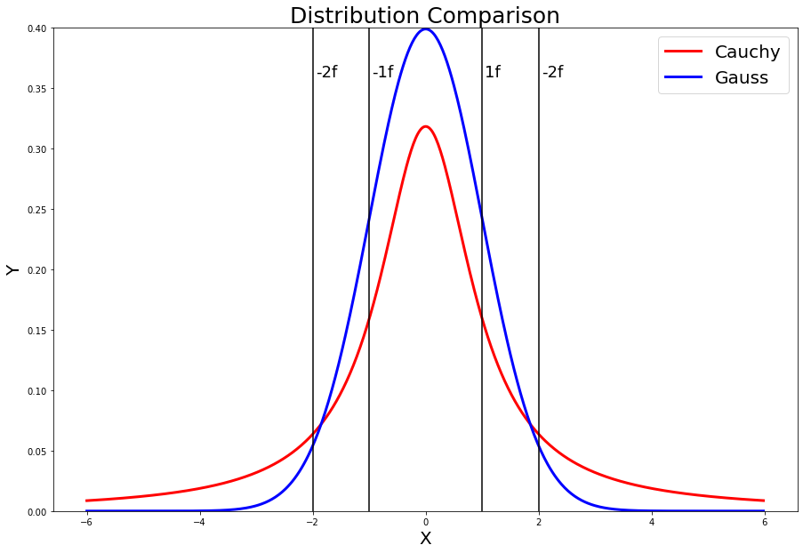

# MVAgausscauchy
Demonstrates the differences of the pdf curves of a standard Gaussian distribution
and a Cauchy distribution with location parameter mu = 0 and scale parameter sigma = 1.

```python
# works on numpy 1.23.5, matplotlib 3.6.2 and scipy 1.10.0
import matplotlib.pyplot as plt
import numpy as np
from scipy.stats import cauchy, norm

fig, ax = plt.subplots(figsize=(15,10))

# Plot the Cauchy density
x = np.arange(-6, 6, 0.02)
y_cauchy = cauchy.pdf(x, 0, 1)
ax.plot(x, y_cauchy, 'r-', linewidth=3)

# Plot the standard normal density
y_norm = norm.pdf(x)
ax.plot(x, y_norm, 'b-', linewidth=3)

ax.axvline(x=-2, color='black')
ax.axvline(x=-1, color='black')
ax.axvline(x=1, color='black')
ax.axvline(x=2, color='black')
ax.text(-1.95, 0.36, '-2f', fontsize = 18)
ax.text(-0.95, 0.36, '-1f', fontsize = 18)
ax.text(1.05, 0.36, '1f', fontsize = 18)
ax.text(2.05, 0.36, '2f', fontsize = 18)

ax.legend(['Cauchy', 'Gauss'], loc='upper right', fontsize=20)
ax.set_title('Distribution Comparison', fontsize=25)

ax.set_xlabel('X', fontsize=20)
ax.set_ylabel('Y', fontsize=20)
ax.set_ylim(0, 0.4)

plt.show()
```

