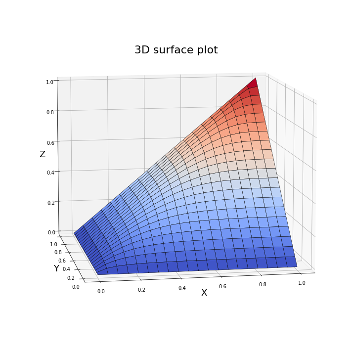

# MVAghsurface
Generates a 3D surface plot of the Gumbel-Hougaard copula for theta = 3.

```python
# works on numpy 1.23.5 and matplotlib 3.6.2
import numpy as np
import matplotlib.pyplot as plt

N = 21
v = u = np.arange(0, 1.01, 0.05)
uu = np.tile(u,N)
vv = np.repeat(v,N)
theta = 3
w = np.exp(-((-np.log(uu))**theta + (-np.log(vv))**theta)**(1/theta))
ww = w.reshape(N,N)
xx,yy = np.meshgrid(u,v)

fig = plt.figure(figsize=(10, 10))
ax = fig.add_subplot(111, projection='3d')
ax.plot_surface(xx, yy, ww, cmap='coolwarm', linewidth=0.5, edgecolor='black')
ax.set_xlabel('X', fontsize=18)
ax.set_ylabel('Y', fontsize=18)
ax.set_zlabel('Z', fontsize=18)
ax.set_title('3D surface plot', fontsize=22, y = 0.92)
ax.view_init(elev=10, azim=260)
plt.tight_layout()
plt.show()
```
