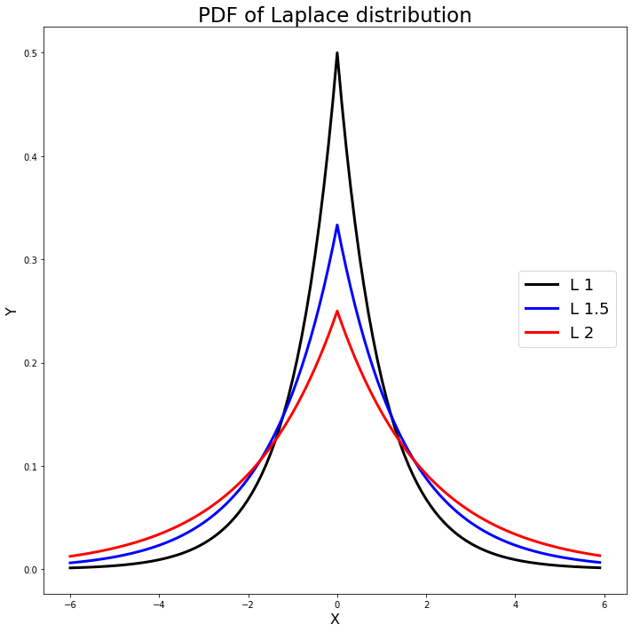
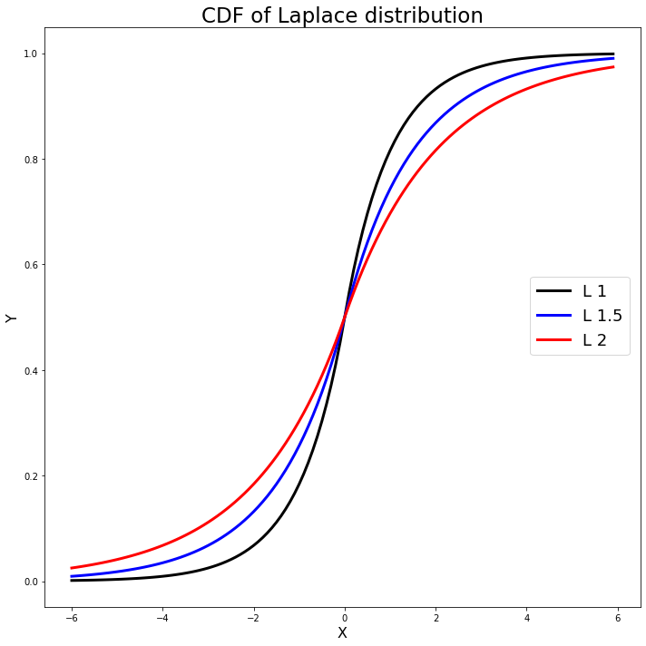

# MVAlaplacedis
Plots three probability density functions and three cumulative density functions of
the Laplace-distribution with different scale (L1 stands for Laplace-distribution with scale 1,
etc).

```python
import numpy as np
from scipy.stats import laplace
import matplotlib.pyplot as plt

# PDF of Laplace distribution
xx = np.arange(-6, 6, 0.1)
pdf1 = laplace.pdf(xx, scale = 1)
pdf1_5 = laplace.pdf(xx, scale = 1.5)
pdf2 = laplace.pdf(xx, scale = 2)

fig1, ax1 = plt.subplots(1,1,figsize=(10, 10))

ax1.plot(xx, pdf1, 'k-', linewidth=3, label='L 1')
ax1.plot(xx, pdf1_5, 'b-', linewidth=3, label='L 1.5')
ax1.plot(xx, pdf2, 'r-', linewidth=3, label='L 2')
ax1.set_xlabel('X', fontsize=16)
ax1.set_ylabel('Y', fontsize=16)
ax1.set_title('PDF of Laplace distribution', fontsize=23)
fig1.legend(fontsize=18, loc =(0.82, 0.45))

plt.tight_layout()
plt.show()

# CDF of Laplace distribution
cdf1 = laplace.cdf(xx, scale = 1)
cdf1_5 = laplace.cdf(xx, scale = 1.5)
cdf2 = laplace.cdf(xx, scale = 2)

fig2, ax2 = plt.subplots(1,1,figsize=(10, 10))

ax2.plot(xx, cdf1, 'k-', linewidth=3, label='L 1')
ax2.plot(xx, cdf1_5, 'b-', linewidth=3, label='L 1.5')
ax2.plot(xx, cdf2, 'r-', linewidth=3, label='L 2')
ax2.set_xlabel('X', fontsize=16)
ax2.set_ylabel('Y', fontsize=16)
ax2.set_title('CDF of Laplace distribution', fontsize=23)
fig2.legend(fontsize=18, loc =(0.82, 0.45))

plt.tight_layout()
plt.show()
```


