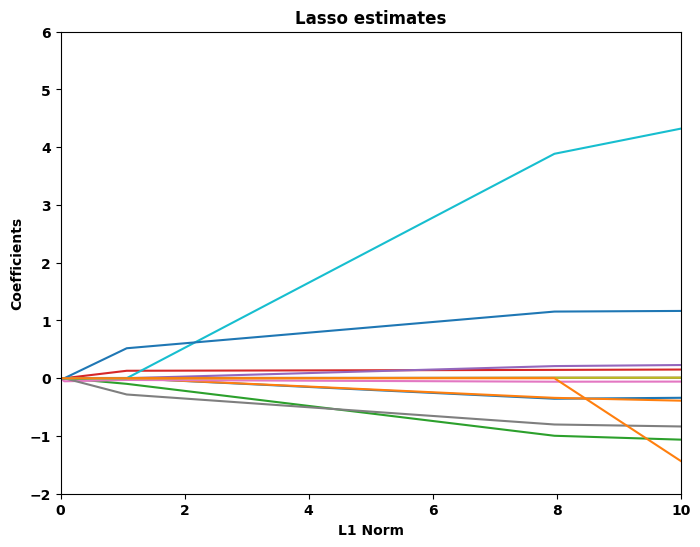
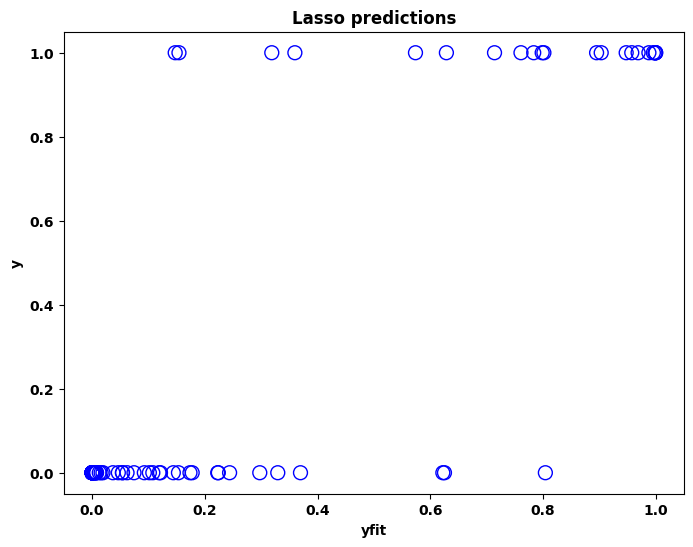

# MVAlassologit
Performs a logit model using the Lasso methodology. The estimates become nonzero at
a point that means the variables enter the model equation sequentially as the shrinkage parameter
increases. The Lasso technique results in variable selection. Finally, the resulting Lasso
estimates and predictions are plotted.

```python
# works on numpy 1.23.5, pandas 1.5.2, scikit-learn 1.2.0 and matplotlib 3.6.2
import pandas as pd
import numpy as np
import matplotlib.pyplot as plt
from sklearn import linear_model

data = pd.read_csv("carc.dat", sep = "\s+", header=None)

y = np.where(data.iloc[:, 1] > 6000, 1, 0)

for i in range(1, 13):
    globals()["x" + str(i)] = data[i+1]

x = pd.DataFrame(data=[globals()["x" + str(r)] for r in range(2, 13)]).transpose()

for j in [3, 4]:
    g = []
    for v in x[j]:
        try: g.append(int(v)+1)
        except ValueError:
            g.append(1)
    x[j] = g

for u in [5, 6, 12]:
    x[u] = x[u].astype(float)

for u in list(range(7, 12)) + [13]:
    x[u] = x[u].astype(np.int64)

lasso_regress = linear_model.LogisticRegressionCV(penalty='l1', solver='liblinear', max_iter=1000).fit(x,y)
lasso_path = np.sum(np.abs(lasso_regress.coefs_paths_[1][0]), axis=1)

fig, ax = plt.subplots(figsize=(8, 6))
ax.plot(lasso_path, lasso_regress.coefs_paths_[1][0])
ax.set_xlim((0,10))
ax.set_ylim((-2,6))
ax.set_xlabel('L1 Norm')
ax.set_ylabel('Coefficients')
ax.set_title('Lasso estimates')
plt.show()

y_pred = lasso_regress.predict_proba(x)
fig, ax = plt.subplots(figsize=(8,6))
ax.scatter(y_pred[:,1], y, s = 100, facecolors = 'none', edgecolors = 'b')
ax.set_xlabel('yfit')
ax.set_ylabel('y')
ax.set_title('Lasso predictions')
plt.show()
```

