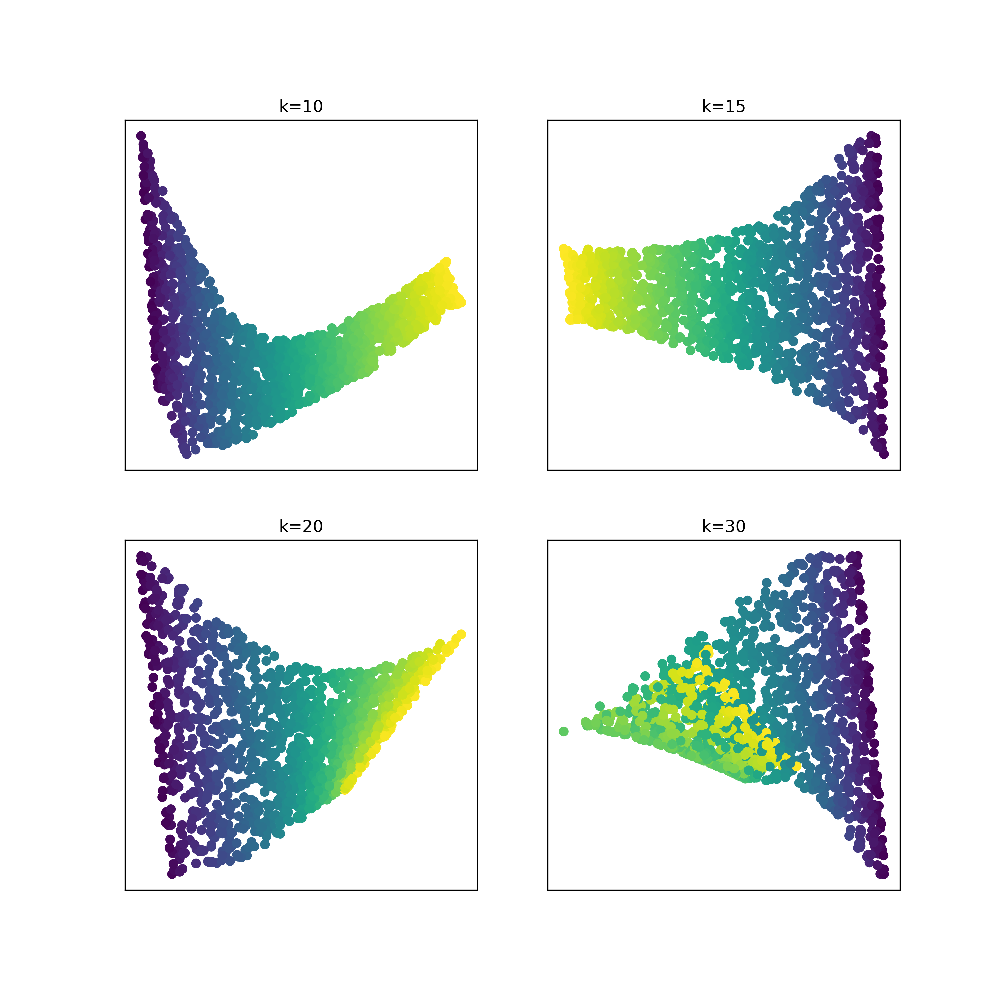

# MVAlleswissroll
The Swiss roll unfolded by means of LLE for different nearest neighbors

```python
#works on pandas 1.5.3, numpy 1.24.3, matplotlib 3.6.2 and sci-kit learn 1.2.2 
import pandas as pd
import numpy as np
import matplotlib.pyplot as plt
from sklearn import manifold, datasets

X,t = datasets.make_swiss_roll(n_samples=1500, random_state=1, hole=False)
fig = plt.figure(figsize=(8, 6))
ax = fig.add_subplot(111, projection="3d")
fig.add_axes(ax)
ax.scatter(
    X[:, 0], X[:, 1], X[:, 2], c=t, s=50, alpha=0.8
)
ax.view_init(azim=-66, elev=12)
plt.show()

neighbors = [10, 15, 20, 30,]
n_components = 2

fig, ax = plt.subplots(2, 2, figsize = (10,10))
ax = ax.ravel()

for i, n_neighbors in enumerate(neighbors):

    LLE = manifold.LocallyLinearEmbedding(
        n_neighbors=n_neighbors,
        n_components=n_components
    )
    Y = LLE.fit_transform(X)
    ax[i].set_title("k=%d" % n_neighbors)
    ax[i].scatter(Y[:,0], Y[:,1], c = t)
    ax[i].set_xticks([])
    ax[i].set_yticks([])

plt.show()
```

