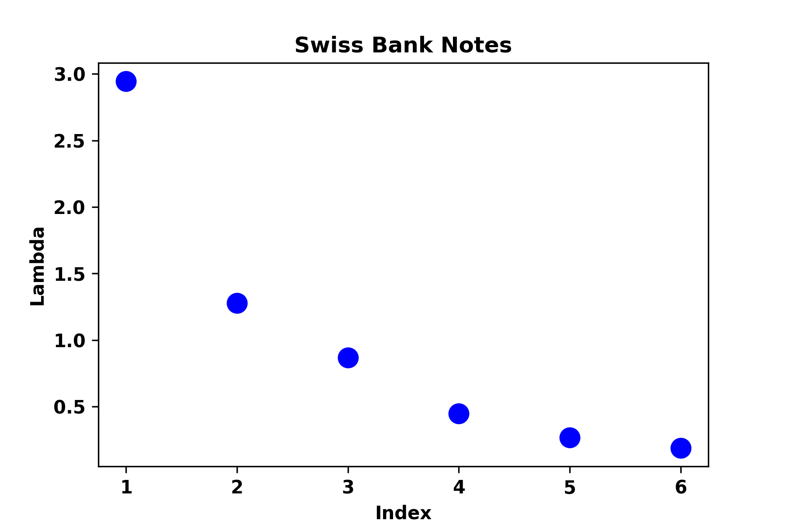
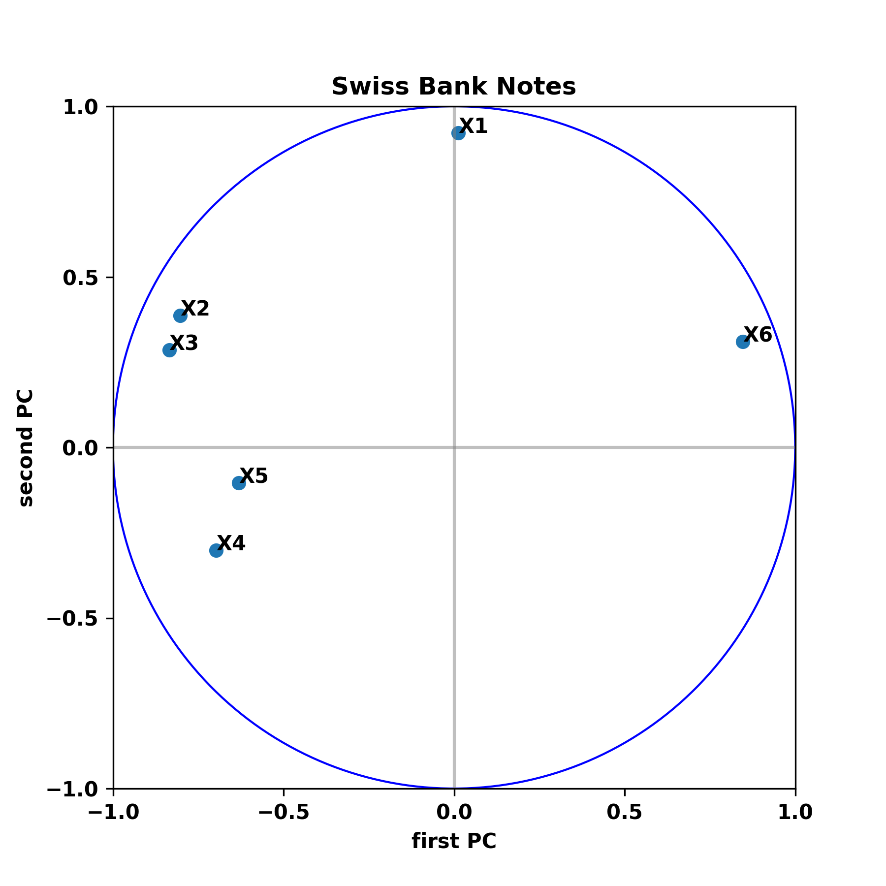

# MVAnpcabanki
Shows a screeplot of the eigenvalues for the PCA of the Standardized Swiss bank
notes. Additionally, it computes the correlations between the variables and the principal
components and displays the first two of them.

```python
#works on numpy 1.25.2, pandas 2.1.1 and matplotlib 3.8.0
import numpy as np
import pandas as pd
import matplotlib.pyplot as plt
from matplotlib.patches import Circle

x = pd.read_csv("bank2.dat", sep = "\s+", header=None)
x = (x-x.mean())/x.std()
cov_matrix = np.cov(x, rowvar=False)
e,v = np.linalg.eig(cov_matrix)
r = np.dot(x,v)
r = np.corrcoef(np.column_stack((r, x)), rowvar=False)
r1 = r[6:12,0:2]

fig, ax = plt.subplots(figsize=(6,4))

ax.scatter(range(1,7), e, c='b', s= 110)
ax.set_title('Swiss Bank Notes')
ax.set_xlabel('Index')
ax.set_ylabel('Lambda')

plt.show()

names = [f'X{i}' for i in range(1, 7)]
fig, ax = plt.subplots(figsize=(6,6))
ax.plot([0,0],[-1,1], color='grey', alpha=0.5)
ax.plot([-1,1],[0,0], color='grey', alpha=0.5)
ax.set_ylim(-1,1)
ax.set_xlim(-1,1)
circle = Circle((0,0), 1, color='b', fill=False)
ax.add_patch(circle)
ax.set_xticks([-1,-0.5,0,0.5,1])
ax.set_yticks([-1,-0.5,0,0.5,1])
ax.set_aspect('equal')
ax.scatter(r1[:,0], r1[:,1])
for i, name in enumerate(names):
    ax.annotate(name, (r1[i,0], r1[i,1]))
ax.set_xlabel('first PC')
ax.set_ylabel('second PC')
ax.set_title('Swiss Bank Notes')

plt.show()
```

