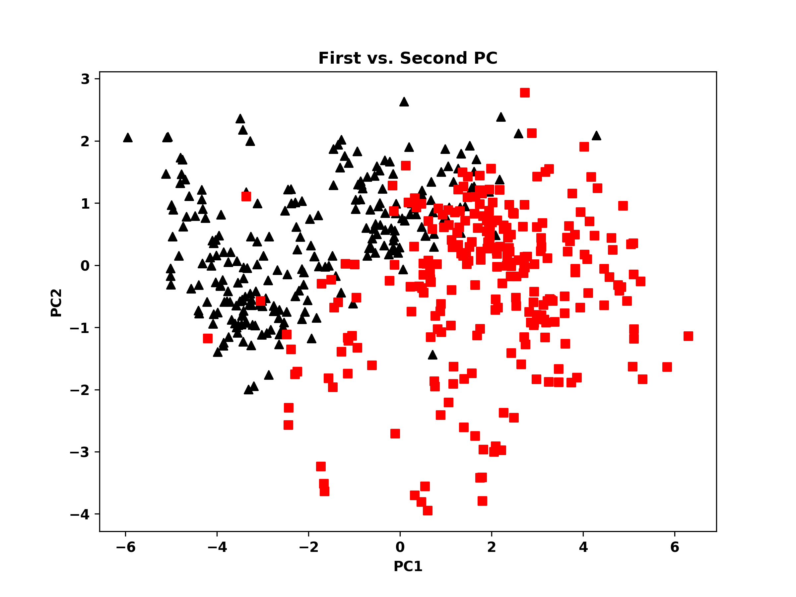
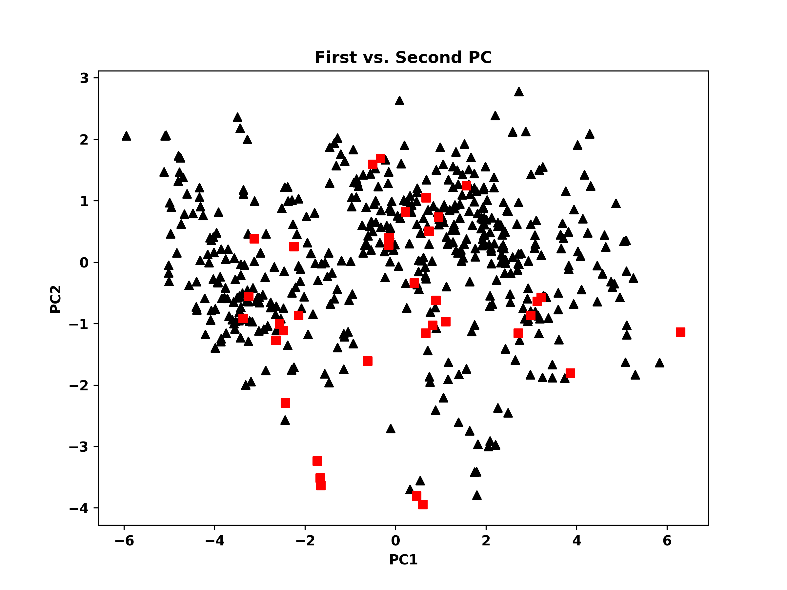

# MVAnpcahous
Performs a PCA for the Standardized Boston housing data. Determines the explained
variance for the eigenvalues, which determine the relevant principal components.

```python
#works on numpy 1.25.2, pandas 2.1.1 and matplotlib 3.8.0
import numpy as np
import pandas as pd
import matplotlib.pyplot as plt

df = pd.read_csv('bostonh.dat', sep='\s+', header=None, names=np.arange(1,15,1))

df2 = pd.DataFrame()
df2[[1,3,5,6,8,9,10,14]] = np.log(df[[1,3,5,6,8,9,10,14]])
df2[4] = df[4]
df2.loc[:,2] = df.loc[:,2]/10
df2.loc[:,7] = (pow(df.loc[:,7],2.5))/10000
df2.loc[:,11] = (np.exp(0.4*df.loc[:,11]))/1000
df2.loc[:,12] = df.loc[:,12]/100
df2.loc[:,13] = pow(df.loc[:,13],0.5)
df2 = df2[np.arange(1,15,1)]

x = df2.drop(columns=[4])
n1, n2 = x.shape
x = (x-x.mean())/(np.sqrt((n1-1) * np.var(x, axis=0)/n1))

cov_matrix = np.cov(x, rowvar=False)
e, v = np.linalg.eig((n1-1) * cov_matrix/n1)
xv = np.dot(x, v)
xv = xv * (-1)

h1 = (df2[13] > df2[13].mean()).astype(int)

fig, ax = plt.subplots(figsize=(8,6))
ax.scatter(xv[:,0][h1==1], xv[:,1][h1==1], c='black', marker='^')
ax.scatter(xv[:, 0][h1==0], xv[:, 1][h1==0], c='r', marker='s')
ax.set_title('First vs. Second PC')
ax.set_xlabel('PC1')
ax.set_ylabel('PC2')
plt.show()

fig, ax = plt.subplots(figsize=(8, 6))
ax.scatter(xv[:, 0][df2[4]==0], xv[:, 1][df2[4]==0], c='black', marker='^')
ax.scatter(xv[:, 0][df2[4]==1], xv[:, 1][df2[4]==1], c='r', marker='s')
ax.set_title('First vs. Second PC')
ax.set_xlabel('PC1')
ax.set_ylabel('PC2')
plt.show()
```

