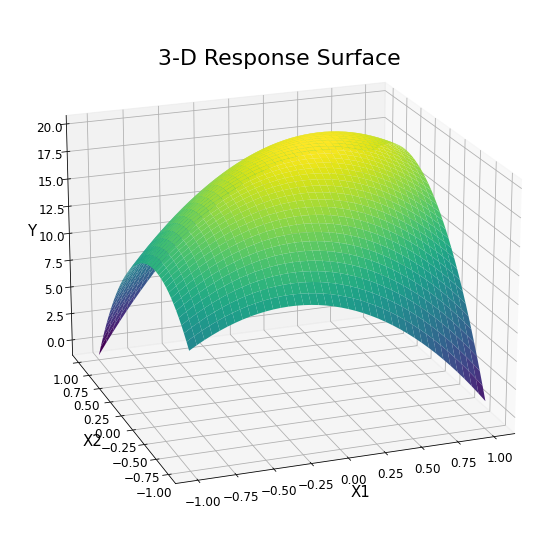

# MVAresponsesurface
Plots 3D response surfaces and a contour plot for the variable y and the two factors
that explain the variation of y via the quadratic response model.

```python
# works on numpy 1.24.3 and matplotlib 3.6.2
import numpy as np
import matplotlib.pyplot as plt

x1 = np.arange(-1, 1.05, 0.05)
n1 = len(x1)
x2 = np.arange(-1, 1.05, 0.05)
n2 = len(x2)

# Set beta
b = np.array([20, 1, 2, -8, -6, 6])

L = np.empty((n1, n2))
x = np.empty((n1, n2))

# Calculate y
for i in range(n1):
    xi = x1[i]
    temp = np.empty(n2)
    for j in range(n2):
        xj = x2[j]
        Lij = b[0] + b[1] * xi + b[2] * xj + b[3] * xi**2 + b[4] * xj**2 + b[5] * xi * xj
        temp[j] = Lij
    L[i] = temp

fig, ax = plt.subplots(1,1, figsize = (10,10), subplot_kw=dict(projection='3d'))

x1, x2 = np.meshgrid(x1, x2)
ax.plot_surface(x1, x2, L, cmap='viridis')
ax.set_xlabel('X1', fontsize = 15)
ax.set_ylabel('X2', fontsize = 15)
ax.set_zlabel('Y', fontsize = 15)
ax.set_title('3-D Response Surface', fontsize = 22, y = 0.96)
ax.tick_params(labelsize=12)
ax.view_init(20, -110)
plt.show()

# Contour plot
contours = np.arange(0,22,2)
fig, ax = plt.subplots(1,1, figsize = (10,10))
CS = ax.contour(x1, x2, L, contours)
ax.clabel(CS, contours, fontsize = 16)
ax.set_xlabel('X1', fontsize = 20)
ax.set_ylabel('X2', fontsize = 20)
ax.tick_params(labelsize=15)
ax.set_title('Contour Plot', fontsize = 22)
plt.show()

```


