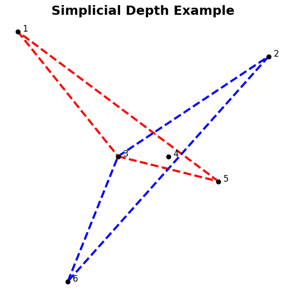

# MVAsimdep1
Shows an example for the simplicial depth in 2 dimensions.

```python

# Works on numpy 1.24.2, matplotlib 3.7.1
import matplotlib.pyplot as plt
import numpy as np

# Data
t = np.array([1, 2, 3, 4, 5, 6])
a = np.array([10, 0, 5, 5, 4, 9])
x1 = np.column_stack((t, a))

# Plot
plt.figure(figsize=(7, 7))
plt.scatter(x1[:, 0], x1[:, 1], c='black', zorder=5)

# Text labels
for i, txt in enumerate(['1', '6', '3', '4', '5', '2']):
    plt.text(x1[i, 0] + 0.1, x1[i, 1], txt, fontsize=12)

# Red triangle
plt.plot([x1[0, 0], x1[2, 0]], [x1[0, 1], x1[2, 1]], 'r--', lw=3)
plt.plot([x1[2, 0], x1[4, 0]], [x1[2, 1], x1[4, 1]], 'r--', lw=3)
plt.plot([x1[4, 0], x1[0, 0]], [x1[4, 1], x1[0, 1]], 'r--', lw=3)

# Blue triangle
plt.plot([x1[1, 0], x1[2, 0]], [x1[1, 1], x1[2, 1]], 'b--', lw=3)
plt.plot([x1[2, 0], x1[5, 0]], [x1[2, 1], x1[5, 1]], 'b--', lw=3)
plt.plot([x1[5, 0], x1[1, 0]], [x1[5, 1], x1[1, 1]], 'b--', lw=3)

# Plot title and labels
plt.title('Simplicial Depth Example', fontsize=18, weight='bold')
plt.axis('off')

plt.show()

```
